# 🏨 Hotel Management System
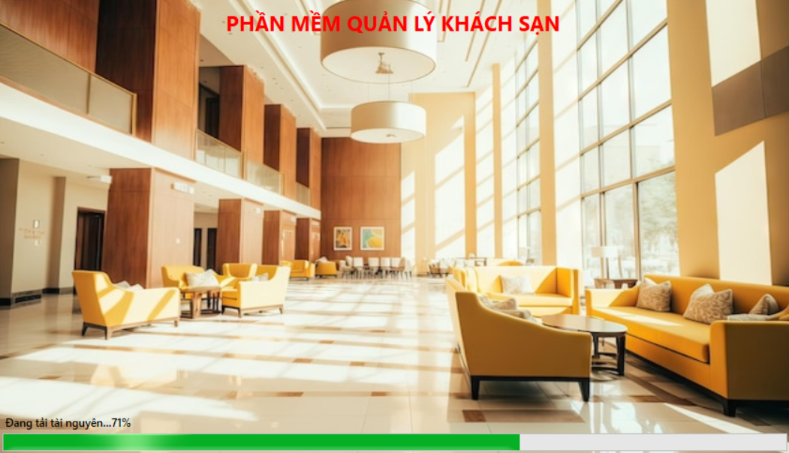

A **C#** application developed as a project for the *Software Engineering* class, aimed at managing various aspects of hotel operations efficiently. This system integrates **Firebase** for secure token management and email verification using the **Gmail API**.

<br>
<br>

## 🌟 Features Overview  

### 🔑 Authentication  
- **Login**

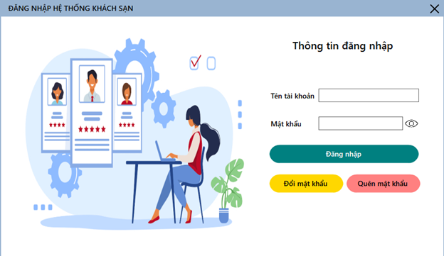

- **Change Password**  

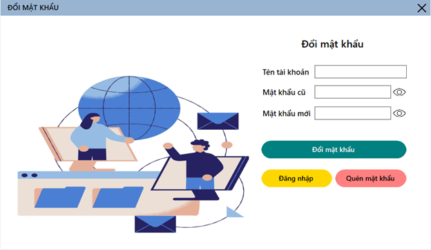

- **Forgot Password**: Sends a verification code to registered email using **Firebase**.  

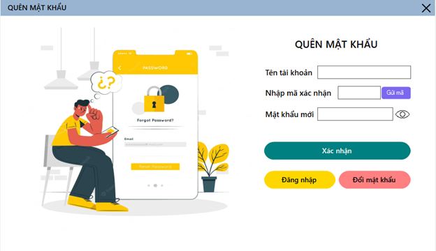

### 🏠 Main Dashboard  
A central hub for navigating the system's functionalities with user-friendly UI.  

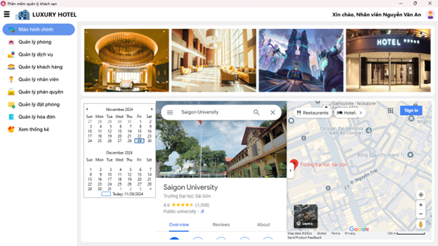

### 🏢 Room Management  
- Manage room details including:  
  - **Room Name**  
  - **Type**: VIP or Standard  
  - **Details**: Single, Double, Family  
  - **Extension**: TV, bed,... 
  - **Pricing**  

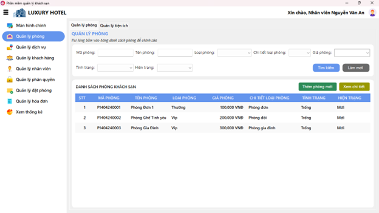

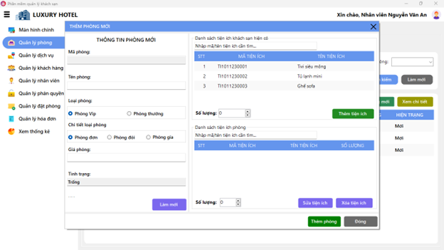

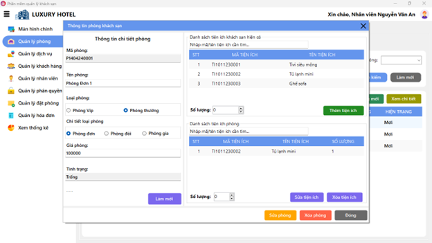

### 📺 Room Amenities Management  
- Track and manage available amenities like:  
  - **TV**  
  - **Iron**  
  - **Hair Dryer**  

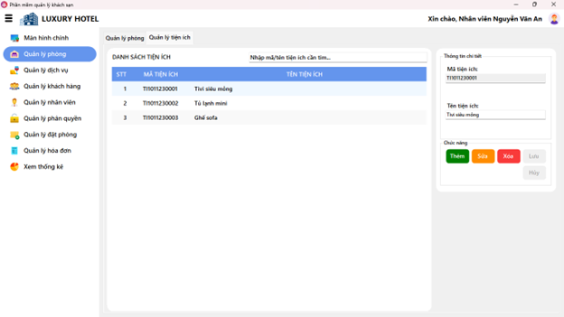

### 🛎️ Service Management  
- Add-on services that guests can choose from:  
  - **Massage**  
  - **Buffet**  
  - **Gym**  

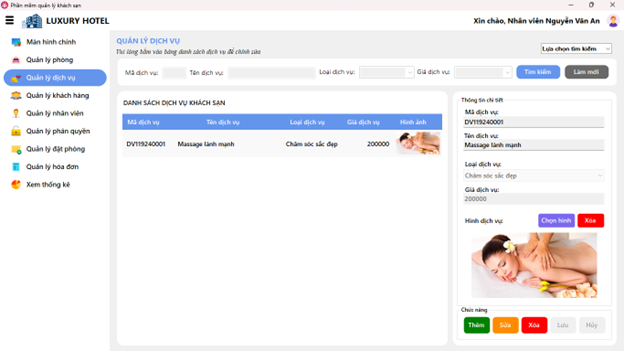

### 👥 Customer Management  
Efficiently handle guest information and history.  

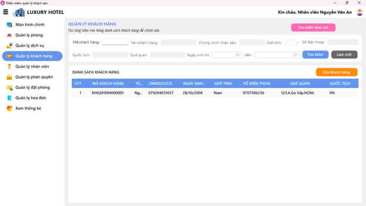

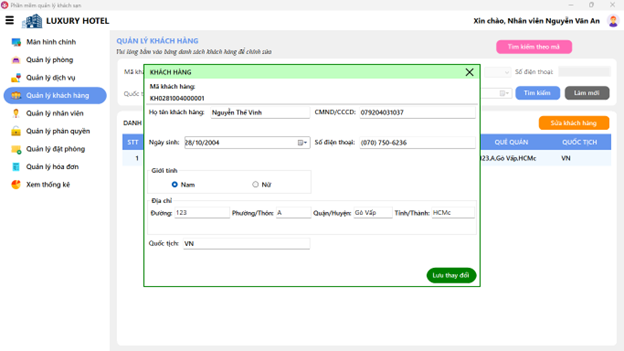

### 👔 Employee Management  
- Manage staff records.  
- **Excel Import/Export** for seamless data handling.  

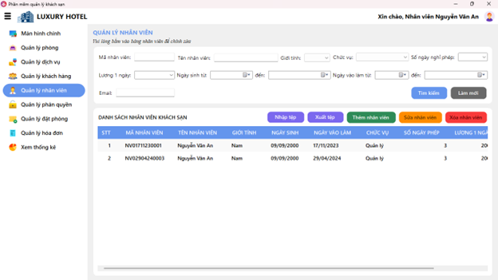

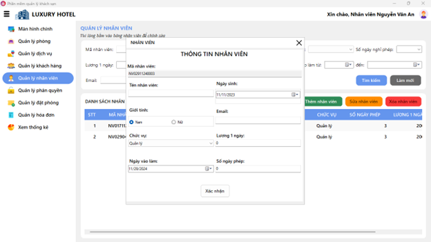

### 🛌 Booking Management  
- Manage room bookings and services by:  
  - **Day**  
  - **Hour**  
  - **Flexible return dates**  

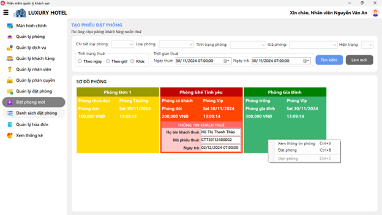

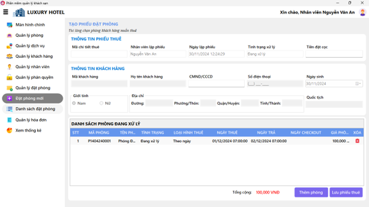

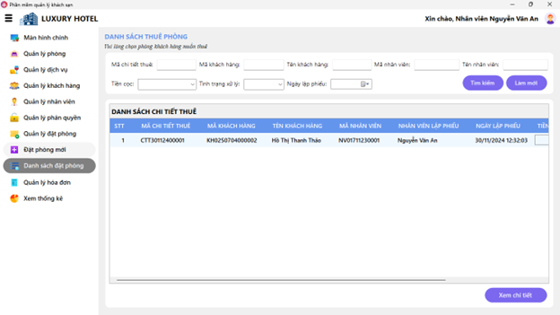

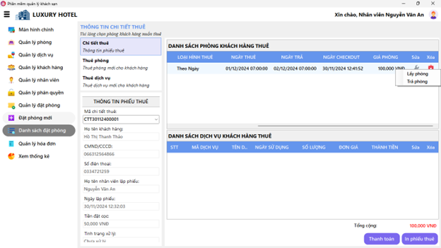

### 💳 Billing  
- Comprehensive invoice management for room and service charges.  

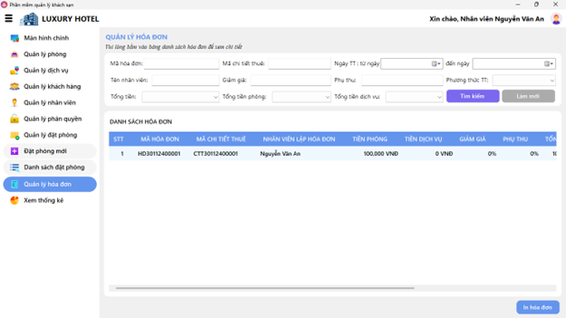

### 📊 Statistics & Reports  
- Generate detailed revenue reports by:  
  - **Room type**  
  - **Room details** (Single, Double, Family)  
  - **Room vs. Service charges**  
  - **Time ranges** (daily, monthly, yearly, etc.) 

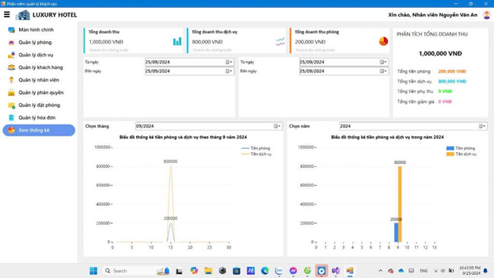

---

<br>
<br>

## 🛠️ Technologies Used  

| Component            | Technology       | Description                                      |  
|-----------------------|------------------|--------------------------------------------------|  
| Frontend UI          | **WinForms**    | User interface for the application.             |  
| Backend Logic        | **C#**           | Core business logic implementation.             |  
| Database             | **SQL Server**   | Data storage and retrieval.                     |  
| Email Integration    | **Firebase**     | Secure token and Gmail API integration.         |  
| Reporting            | **Excel**        | Export and generate data insights.              |  

---

## 🚀 How to Run  

1. **Clone the repository**:  
   ```bash  
   git clone https://github.com/WNormanTPN/hotel-management-system  
2. **Using Microsoft Visual Studio to open solution.**
3. **Run for debug or build solution for release.**

<br>
<br>

**Enjoy ^^**